# fabric-state

CVE queue state and scan history for [fabric-ctrl](https://github.com/git-fabric/fabric-ctrl), the git-fabric control plane. fabric-ctrl writes here; this repo is its state store and audit trail, so don't edit it by hand.

<!-- org-footer -->
---

Part of <a href="https://github.com/git-fabric">git-fabric</a> · composable fabric apps for Git-native infrastructure · built by <a href="https://github.com/ry-ops">ry-ops</a>

